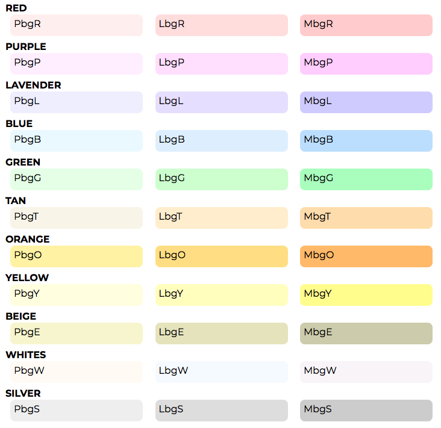
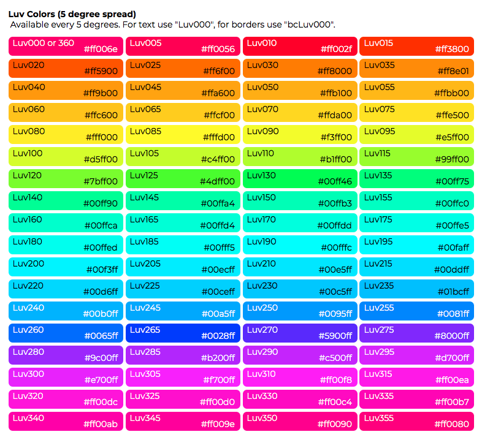

# TinyTrim v0.0.84 - betafish
A set of CSS generic classes for on-the-fly adjustment of elements without having to add a long style list every time you need to adjust an element like:

    style="lots-of-stuff: #ugh;"

This CSS sheet is mainly for use in development and early design stages, but can be useful for sites where you need a lot of flexibility for special pages.

## Classes

The class names are very terse. For instance, font-size is fs, and setting an element to font-size: 1.2em; is the class **.fs12** setting all margins to 0 is .m0 or setting the top margin to 12px is mt12p  etc.

There's a set of classes for standard HTML color names, plus a set for color and border-color using LuvLCh colors in 5 dgree increments as in Luv015 is Luv 15 degrees, which is red. And a set of colors specifically for background use, all of which are light enough for body text.

## Colors

This is a small subset of **Color-StyleS**

### Light Backgrounds

The light backgrounds are for a background for text, including body text. The class name has three parts:

**p l m** meaning Pastel, Light, or Medium

**bg** Obviously for background-color

**R B G** etc for the color ID

Thus **PbgB** is the lightest (pastel) of Blue as background-color




### Luv Colors

The Luv colors are useable for text with "luv000" or border-color with "bcluv000" where 000 is the three digit hue, in five degree increments starting at 000 through 360 (which is the same as 000).



### HTML Named Colors

The ever so yucky basic HTML colors are here for ... well, they're here.

Simple class names:

.c is for `color:`, .bg is for `background-color:`, and .bc is for `border-color:`
Each is available by the full name, or one or two shorthands:

Example for Black, showing `color:`,  `background-color:`, and `border-color:`

    .cBlack,    .cBlk, .cBk
    .bgBlack,   .bgBlk,.bgBk
    .bcBlack,   .bcBlk,.bcBk

For the rest, we'll just show `color:`, the others follow the same naming convention.

    .cBrown,    .cBrn, .cBn
    .cNavy,     .cNvy, .cN
    .cBlue,     .cBlu, .cB
    .cYellow,   .cYlw, .cY
    .cRed,      .cR       
    .cOrange,   .cOrg, .cO
    .cTan,      .cTn
    .cMaroon,   .cMrn, .cMn
    .cPurple,   .cPur, .cP
    .cMagenta,  .cMag, .cM
    .cFuchsia,  .cFsh, .cF
    .cOlive,    .cOlv, .cOv
    .cGreen,    .cGrn, .cG
    .cTeal,     .cTea, .cT
    .cLime,     .cLim, .cL, 
    .cAqua,     .cAqu, .cA
    .cGray,     .cGry, .cGy
    .cSilver,   .cSlv, .cS
    .cWhite,    .cWht, .cW      


## REFERENCE GUIDE
### FIRST LETTER:
***a '0' indicates a number is required***

```
.a .un  all:
.al     align, alias for text-align (ta)
.d .ds  display: (see display section)

.fl     float
.c .cl  clear

.w0     width
.h0     height

///// Not implemented yet 
.mnw0   min-width
.mnh0   min-height
.mxw0   max-width
.mxh0   max-height
/////////////////////////

.m0     margin
.ma0    margin set vertical numeric and auto for horizontal

.mt0 .mr0 .mb0 .ml0  top right bottom left

.p0     padding

.pt0 .pr0 .pb0 .pl0  top right bottom left

.po     position settings (abs, rel etc)
.po0    position adjust

.pot0 .por0 .pob0 .pol0  top right bottom left

.z0 z-index

.b0 border

//// NOT IMPLEMENTED: .bt0 .br0 .bb0 .bl0  top right bottom left border ////

.br0    border radius

.f      font
.ff     font-family
.fs0    font-size (.fs no numeric is font style)
.fw0    font-weight
.ft or .fs  font-style
.fd or .td  text-decoration (font decoration is an alias) aka underline

.bs     box-shadow
.bsi    inset box-shadow
.ts     text-shadow

.tt     text-transform
.t or .ta   text-align
.tl     text-align-last
.ti     text-indent

.v      visibility or vertical align
.va     vertical align for initial, inherit, others as alias
.ws     white-space

.o      overflow
.to     text overflow
```

### 2ND/3RD LETTER:
***depends on context, all contexts shown together***

    i   initial
    h   inherit

    a   auto, absolute
    o   oblique
    it  italic
    
    NoLetter: normal
    
    b   both, bold
    b   (when after numbers): bottom
    
    br  bolder
    lr  lighter
    
    l   light, lowercase, length
    l   (when after numbers): left
    
    r   relative
    r   (when after numbers): right
    
    j   justify (.tj, .taj, .tlj)
    c   center, capitalize, clip

    s   scroll, string, start
    e   end
    t   top (when after numbers)
    xt  text-top
    m   middle
    b   bottom (when after numbers)
    xb  text-bottom

    p   pre
    pl  pre-line
    pw  pre-wrap

    bl  baseline
    n   none, hidden, nowrap
    h   hidden, also hid and hi
    v   visible also vis
    u   unset or uppercase

    NO 2ND/3RD LETTER:  'normal'

    LAST LETTER, AFTER NUMBERS

    r   rem
    p   prcentage
    x   px
    t   pt
    v   vh or vw
    nothing: em or unitless
    


### ••••      TO DO      ••••

Add vmin vw and vh for certain properties

max-width: none|length|initial|inherit;
min-width: length|initial|inherit;

max-height: none|length|initial|inherit;
min-height: length|initial|inherit;

cursor: value;


-----
##  SUGGESTED CSS BLOCK ORDER EXAMPLE

````    
.selector {
    display
    positions
    margins
    paddings
    container size (width/height)
    floats and clears
    
    font-family
    font-size,weight,style,decoration
    letter-spacing & line-height
    text alignment, whitespace
    overflow, other text related
    
    color
    background
    borders/outlines
    opacity
    text-shadow
    box-shadow
    }
````

------
    
## DISPLAY GUIDE 

### General guidelines

    .d or .ds display
    b block
    c content, cell (tc), or container (ruby)
    f flow
    fr flow-root
    fx flex
    g grid or group
    i inline
    ib inline-block
    ih inherit
    it initial
    l list-item
    m column
    n, no  = none
    p caption
    r ruby or row or run-in
    rb ruby base
    rt ruby text
    ry ruby

-----

